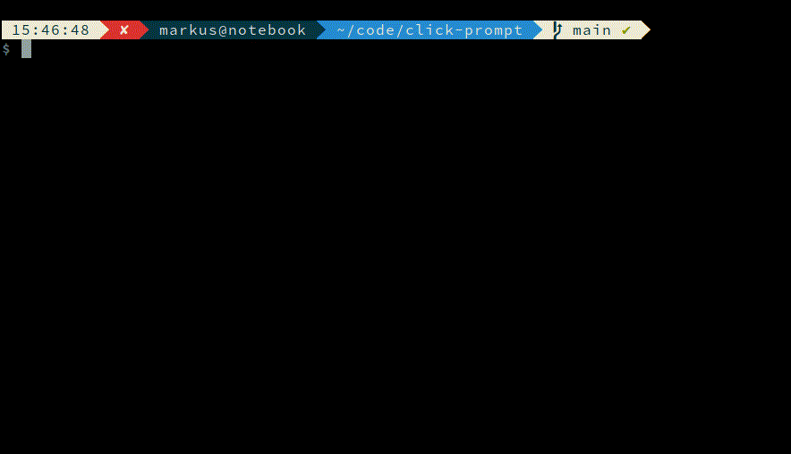

# click-prompt 

[](https://pypi.org/project/click-prompt/) 
[](https://pypi.org/project/click-prompt/) 


**click-prompt** is a Python library that enhances the functionality of the Click library by providing interactive prompts for user inputs. It features simple prompts to easily prompt users for a single/multi input from a list. It also allows for more advanced prompting such as path completion.
This library is inspired by a post on [stackoverflow.com](https://stackoverflow.com/questions/54311067/).
Contributions are welcome! Please send me an e-mail or create a pull request.


## Installation

To install `click-prompt`, use pip:

```bash
pip install click-prompt
```


## Usage

The library can be used with decorators:

```python
import click
from click_prompt import choice_option

@click.command()
@choice_option('--fruit', type=click.Choice(['Apples', 'Bananas', 'Grapefruits', 'Mangoes']))
def select_fruit(fruit: str):
    print(fruit)
```

## Example

For more examples see the file [example.py](./example.py).




## Available Decorators

Here is a list of available decorators that can be used with the click library
instead of a `click.Option` decorator

 - `choice_option`: Select a single item out of a list. Use the parameter
   `multiple=True` to select multiple items out of a list
 - `confirm_option`: Yes/No confirmation
 - `filepath_option`: Select a file path with auto completion
 - `auto_complete_option`: Auto completion given a list

for every `click.Option` there is also a `click.Argument` implementation


## License

This project is licensed under the MIT License. See the [LICENSE](LICENSE.md) file for more information.
